# План внедрения автоматизации

## 1. Перечень автоматизируемых сценариев.

## **1.1 Автоматизация проходов с главной страницы до страницы профессии "Тестировщик ПО"**

**Предусловия:** Открыта главная страница сайта Нетологии [https://netology.ru/](https://netology.ru/).

**Ожидаемый результат:** переход на страницу профессии "Тестировщик ПО"

 

* ## **Переход через кнопки "Каталог курсов" - "Программирование" и поле ввода**
 
 ### Шаги
 1. Нажать на главной странице кнопку "Каталог курсов".

 

 2. Нажать в выпавшем списке кнопку "Программирование".

 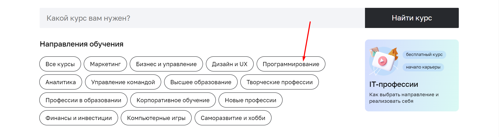

 3. Набираем в поле ввода первый слог профессии ("тес").

 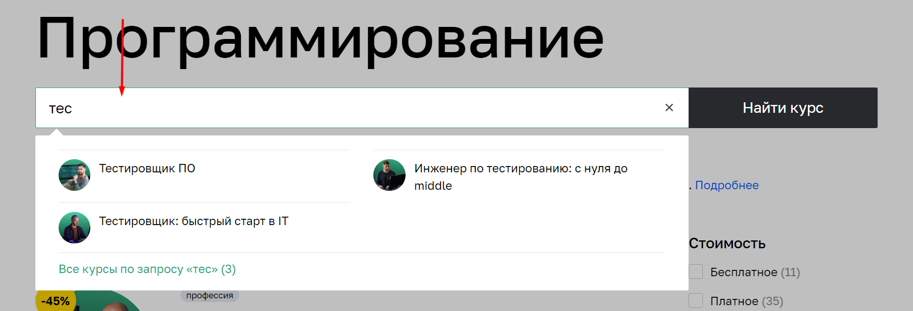

 4. Нажимаем иконку профессии.

 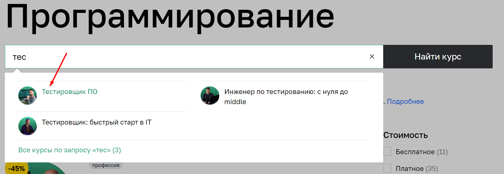

 

* ## **Переход через кнопки "Каталог курсов" - "Все курсы" и поле ввода**

 1. Нажать на главной странице кнопку "Каталог курсов".

 

 2. Нажать в выпавшем списке кнопку "Все курсы".

 

 3. Набираем в поле ввода первый слог профессии ("тес").

 

 4. Нажимаем иконку профессии.

 

* ## **Переход через кнопки "Каталог курсов" - "Все курсы" и раздел профессии**

 1. Нажать на главной странице кнопку "Каталог курсов".

 

 2. Нажать в выпавшем списке кнопку "Все курсы".

 

 3. Пролистать страницу до нужной профессии (Тестировщик ПО).

 4. Нажать на раздел с профессией.
 
 

* ## **Переход через кнопки "Каталог курсов" - "Программирование" и раздел профессии**

 1. Нажать на главной странице кнопку "Каталог курсов".

 

 2. Нажать в выпавшем списке кнопку "Программирование".

 
 
 3. Пролистать страницу до нужной профессии (Тестировщик ПО).

 4. Нажать на раздел с профессией.
 
 

* ## **Переход через кнопки "Полный каталог" - "Программирование" и поле ввода**

 1. Пролистать страницу до кнопки "Полный каталог" и нажать ее.

 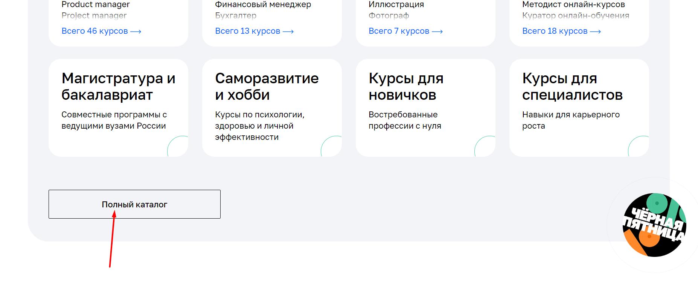

 2. Нажать в списке кнопку "Программирование"

 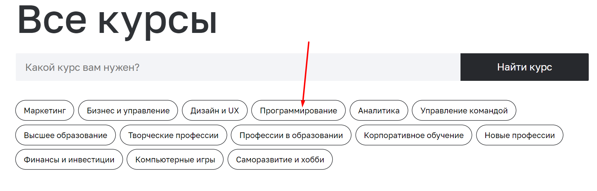

 3. Набираем в поле ввода первый слог профессии ("тес").

 

 4. Нажимаем иконку профессии.

 

* ## **Переход через кнопку "Полный каталог" и поле ввода**

 1. Пролистать страницу до кнопки "Полный каталог" и нажать ее.

 

 2. Набираем в поле ввода первы слог профессии ("тес").

 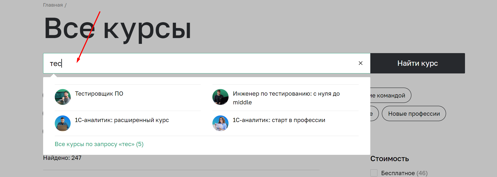

 3. Нажимаем иконку профессии.

 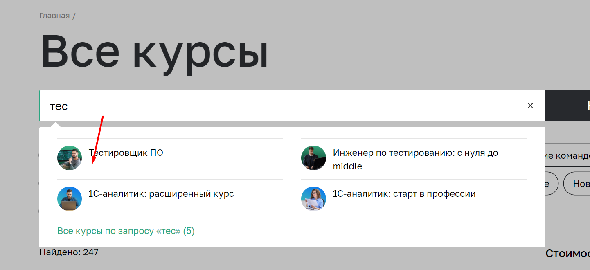

* ## **Переход через кнопки "Полный каталог" - "Программирование" и раздел профессии**

 1. Пролистать страницу до кнопки "Полный каталог" и нажать ее.

 

 2. Нажать в списке кнопку "Программирование"

 

 3. Пролистать страницу до нужной профессии (Тестировщик ПО).

 4. Нажать на раздел с профессией.
 
 

* ## **Переход через кнопку "Полный каталог" и раздел профессии**

 1. Пролистать страницу до кнопки "Полный каталог" и нажать ее.

 

 2. Пролистать страницу до нужной профессии (Тестировщик ПО).

 3. Нажать на раздел с профессией.
 
 

* ## **Переход через кнопку "Программирование" и раздел профессии**

 1. Пролистать страницу до кнопки "Программироавние" и нажать ее.

 

 2. Пролистать страницу до нужной профессии (Тестировщик ПО).

 3. Нажать на раздел с профессией.
 
 

* ## **Переход через кнопку "Программирование" и поле ввода**

 1. Пролистать страницу до кнопки "Программироавние" и нажать ее.

 

 2. Набираем в поле ввода первый слог профессии ("тес").

 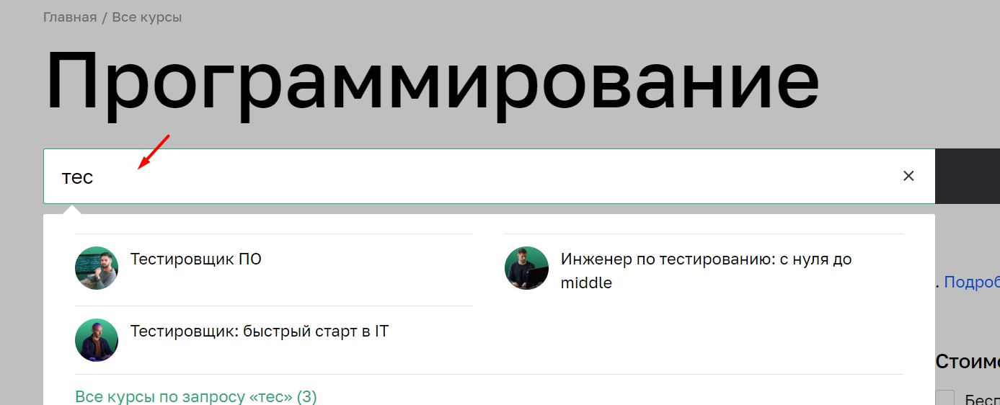

 3. Нажимаем иконку профессии.

 

## **1.2 Автоматизация проходов со страницы профессии к форме для записи**

**Предусловия:** Открыта страница профессии Тестировщик ПО на сайте Нетологии [https://netology.ru/programs/qa](https://netology.ru/programs/qa).

**Ожидаемый результат:** переход на форму для записи на обучение

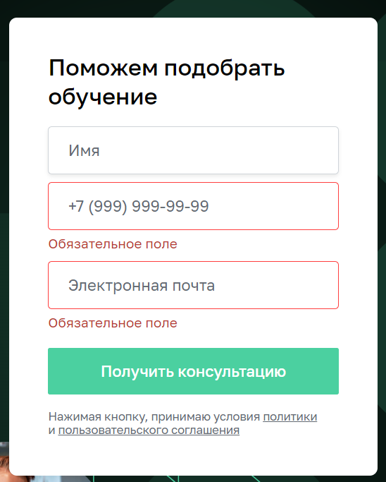

* ## **Переход через кнопку "Записаться" слева**

 1. Пролистываем страницу до кнопки "Записаться" слева и нажимаем на нее

 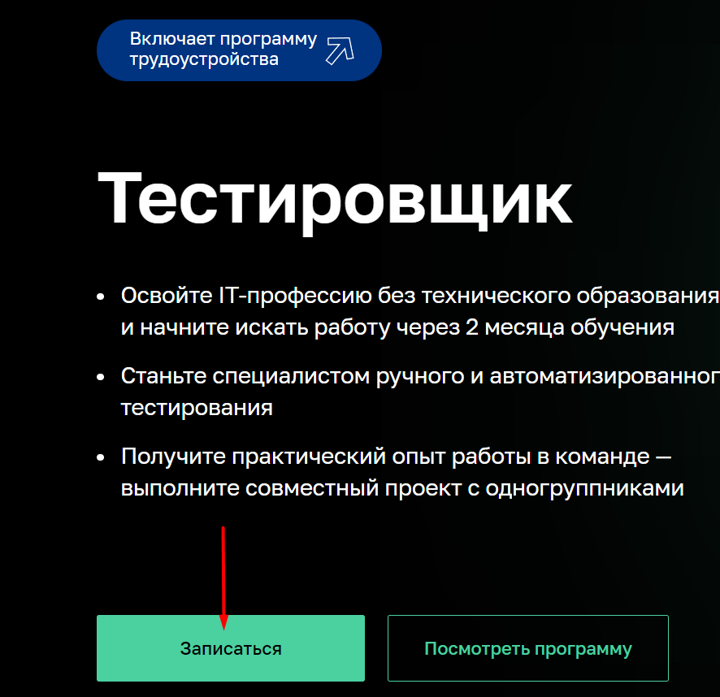3

* ## **Переход через всплывающую форму записаться вверху**

 1. Пролистываем страницу до появления кнопки "Записаться" вверху и нажимаем ее

 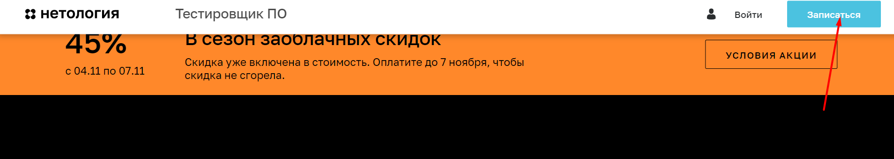

* ## **Переход пролистыванием страницы до формы записи**
 
 1. Пролистываем страницу до формы записи

 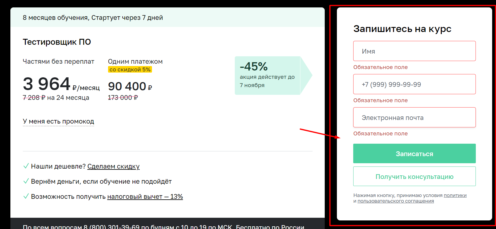 

## **1.2 Автоматизация тестирования отправки формы**

**Предусловия:** Открыта форма записи на странице профессии Тестировщик ПО на сайте Нетологии [https://netology.ru/programs/qa#/order](https://netology.ru/programs/qa#/order).

**Валидные данные:**
 * Поле "Имя"
 Допустимы: кириллица, латинница, дефис, пробел (пример: Екатерина).
 * Поле "+7 (999) 999-99-99"
 Допустимы: + в начале, 10-11 арабских цифр (не все 0 и должныч быть обязательно), дефисы, пробелы, круглые скобки (пример: +7 (904) 863-10-49)
 * Поле "Электронная почта"
 Допустимы: латинница, цифры,  есть 1 точка не первым и не последним символом, есть @, точка идет в части адреса после @ (пример: kotovaea@ro.ru).

* ## **Отправка формы заполненной валидными данными**

 1. Заполнить все поля формы валидными данными.

 2. Нажимаем кнопку "Записаться".

 Ожидаемый результат: форма отправлена, переход на форму оплаты.

* ## **Отправка пустой формы**

 1. Оставить все поля формы пустыми

 2. Нажать кнопку "Записаться"

 Ожидаемый результат: Сообщение об ошибке под каждым полем ("Обязательное поле").

* ## **Отправка формы с невалидным значением в поле "Имя"**

 1. В поле "Имя" ввести невалидное значение (пример: Екатерина123).

 2. Остальные поля заполнить валидными данными

 3. Нажать кнопку "Записаться"

 Ожидаемый результат: Сообщение об ошибке под полем "Имя" ("Должно состоять из букв).

* ## **Отправка формы с невалидным значением в поле "+7 (999) 999-99-99" (номер с невалидными символами)**

 1. Заполнить поле "+7 (999) 999-99-99" невалидными данными (8904863104п)

 2. Остальные поля заполнить валидными значениями.

 3. Нажать кнопку "Записаться"

 Ожидаемый результат: Сообщение об ошибке под полем "+7 (999) 999-99-99" ("Номер в формате +9 (999) 999-99-99")

* ## **Отправка формы с невалидным значением в поле "+7 (999) 999-99-99" (8 цифр)**

 1. Заполнить поле "+7 (999) 999-99-99" невалидными данными (12345678)

 2. Остальные поля заполнить валидными значениями.

 3. Нажать кнопку "Записаться"

 Ожидаемый результат: Сообщение об ошибке под полем "+7 (999) 999-99-99" ("Номер в формате +9 (999) 999-99-99")

* ## **Отправка формы с невалидным значением в поле "+7 (999) 999-99-99" (12 цифр)**

 1. Заполнить поле "+7 (999) 999-99-99" невалидными данными (123456789123)

 2. Остальные поля заполнить валидными значениями.

 3. Нажать кнопку "Записаться".

 Ожидаемый результат: Сообщение об ошибке под полем "+7 (999) 999-99-99" ("Номер в формате +9 (999) 999-99-99")

* ## **Отправка формы с невалидным значением в поле "+7 (999) 999-99-99" (11 нулей)**

 1. Заполнить поле "+7 (999) 999-99-99" невалидными данными (00000000000)

 2. Остальные поля заполнить валидными значениями.

 3. Нажать кнопку "Записаться".

 Ожидаемый результат: Сообщение об ошибке под полем "+7 (999) 999-99-99" ("Номер в формате +9 (999) 999-99-99")

* ## **Отправка формы с невалидным значением в поле "Электронная почта" (кириллица)**
 1. Заполнить поле "Электронная почта" невалидными данными (екатерина@.ro.ru).
 2. Остальные поля заполнить валидными значениями.

 3. Нажать кнопку "Записаться".

 Ожидаемый результат: Сообщение об ошибке под полем "Электронныя почта" ("Неверный email").

* ## **Отправка формы с невалидным значением в поле "Электронная почта" (нет собаки)**
 1. Заполнить поле "Электронная почта" невалидными данными (kotovaea.ro.ru).

 2. Остальные поля заполнить валидными значениями.

 3. Нажать кнопку "Записаться".
 
 Ожидаемый результат: Сообщение об ошибке под полем "Электронныя почта" ("Неверный email").

* ## **Отправка формы с невалидным значением в поле "Электронная почта" (нет доменной части)**
 1. Заполнить поле "Электронная почта" невалидными данными (kotovaea@ro).

 2. Остальные поля заполнить валидными значениями.

 3. Нажать кнопку "Записаться".
 
 Ожидаемый результат: Сообщение об ошибке под полем "Электронныя почта" ("Неверный email").

* ## **Отправка формы с невалидным значением в поле "Электронная почта" (точка первым символом)**
 1. Заполнить поле "Электронная почта" невалидными данными (.kotovaea@ro.ru).

 2. Остальные поля заполнить валидными значениями.

 3. Нажать кнопку "Записаться".
 
 Ожидаемый результат: Сообщение об ошибке под полем "Электронныя почта" ("Неверный email").

* ## **Отправка формы с невалидным значением в поле "Электронная почта" (точка последним символом)**
 1. Заполнить поле "Электронная почта" невалидными данными (kotovaea@ro.ru.).

 2. Остальные поля заполнить валидными значениями.

 3. Нажать кнопку "Записаться".
 
 Ожидаемый результат: Сообщение об ошибке под полем "Электронныя почта" ("Неверный email").

* ## **Отправка формы с невалидным значением в поле "Электронная почта" (нет точки в части после @)**
 1. Заполнить поле "Электронная почта" невалидными данными (kotova.ea@roru).

 2. Остальные поля заполнить валидными значениями.

 3. Нажать кнопку "Записаться".
 
 Ожидаемый результат: Сообщение об ошибке под полем "Электронныя почта" ("Неверный email").

## 2. Перечень используемых инструментов с обоснованием выбора.

 * JDK (Java Development Kit) - набор программ для разработки. Именно его мы (или редактор) устанавливаем к себе на компьютер, чтобы заниматься разработкой на Java. Он включает в себя JRE, загрузчик кода java, компилятор javac, архиватор jar, генератор документации javadoc и другие утилиты, нужные во время разработки.

 * JUnit – является одним из самых популярных инструментов для тестирования Java-кода. Он предоставляет простой и удобный способ написания автоматических тестов, а также обеспечивает множество встроенных функций для тестирования, таких как проверка условий и сравнения значений. JUnit также обладает хорошей документацией и большим сообществом пользователей, что обеспечивает быструю поддержку и развитие инструмента.

 * Selenide - основан на Selenium WebDriver, предоставляет простой и понятный API для написания тестов. Одной из главных проблем при тестировании веб-приложений является ожидание изменений в DOM-структуре и загрузки AJAX-контента. Selenide решает эту проблему путем автоматического ожидания элементов и проверки их состояния. Это упрощает написание тестов и делает их более стабильными.

 Selenide также обладает рядом удобных функций, таких как автоматические скриншоты при ошибке, автоматический запуск и остановка браузера, а также простой API для работы с элементами страницы. Инструмент поддерживает несколько популярных фреймворков, таких как JUnit, TestNG и Cucumber, что позволяет интегрировать его в любой проект.

 * DevTools — это инструменты разработчика в браузерах, которые помогают в создании, тестировании, оптимизации сайтов.

 * Faker — это библиотека, которая позволяет генерировать случайные данные. С ее помощью можно заполнить таблицы в базе данных, построить корректные XML-документы, сформировать JSON-ответы для REST

 Инструменты тестирования Java-кода предоставляют множество возможностей для написания автоматических тестов и обеспечивают высокий уровень надежности и безопасности Java-приложений. Выбор конкретного инструмента зависит от конкретных потребностей проекта и команды разработчиков, однако использование любого из перечисленных инструментов поможет существенно улучшить качество и надежность Java-кода.

## 3. Перечень необходимых разрешений, данных и доступов.

 * Разрешение на тестирование и автоматизацию - обязательно
 
  Опционально:
 * Требования к работе
 * Данные для заполнения формы
 * Доступы к базе данных (проверить прошла ли запись)
 * API

## 4. Перечень и описание возможных рисков при автоматизации.

 * Риск увеличить бюджет проекта (съем помещений, зар.плата)
 * Увеличение времени (болезнь, неверно выбранные инструменты, технические проблемы, поиск уникальных инструментов на странице без тестовых меток)

## 5. Перечень необходимых специалистов для автоматизации.

 Тестировщик-автоматизатор - 1 шт.

## 6. Интервальная оценка с учётом рисков в часах.
 Примерно 24 часа (3 рабочих дня по 8 часов) с учетом рисков.